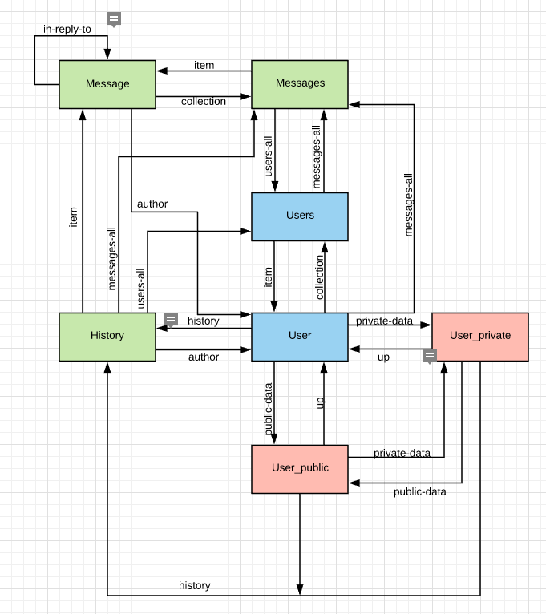

# Important information for Deadline 4

:bangbang:&nbsp;&nbsp;**This chapter should be completed by Deadline 4** *(see course information at [Lovelace](http://lovelace.oulu.fi))*

---

:bookmark_tabs:&nbsp;&nbsp;<strong>Chapter summary</strong>

<bloquote>
In this chapter, the students&nbsp;<strong>must document their RESTful API. The minimum requirements are summarized in the&nbsp;<a href="https://lovelace.oulu.fi/ohjelmoitava-web/ohjelmoitava-web/pwp-project-work-assignment/#minimum-requirements-and-constraints">Minimum Requirements</a>&nbsp;section of the Project Work Assignment. Note that if you do not meet Minimum Requirements this section wont be evaluated.</strong>

<h3>SECTION GOALS: </h3>
<ul>
<li>Understand connectedness and/or hypermedia</li>
<li>Write API documentation</li>
</ul>

	You have two options:
		<ol>
			<li>Implement the API using a non-hypermedia format (RESTful CRUD). In this case, it is recommended that all your resources are connected (linking to other resources). <strong>Anyhow, you cannot get full points in this section if you do not design your API using an hypermedia format</strong></li>
			<li>Using an hypermedia format. Lots of examples provided in Exercise 3. You can get full points. In this case you need to clearly include in the documentation a profile with link relations and semantic descriptors.</li>
		</ol>

---

:heavy_check_mark:&nbsp;&nbsp;&nbsp;&nbsp; <strong>Chapter evaluation (max 15 points)</strong>

<bloquote>
You can get a maximum of 15 points after completing this section. More detailed evaluation is provided in the evaluation sheet in Lovelace.
</bloquote>

---

# RESTful API documentation

## Resource relations

:bookmark_tabs:&nbsp;&nbsp;<strong>Content that must be included in the section</strong>

<bloquote>
Include a state diagram of your application, with all the application states. Each resource must be an application state. Describe also the state transitions. To build this diagram you should reuse the diagram created in DL1. You can use online tools such as <a href="https://www.draw.io/">draw.io or <a href="https://www.lucidchart.com/">lucidchart</a> to create the diagrams. You have an example in the following image

</img>

</bloquote>

---

:pencil2: *Draw here your state machine diagram*

---

## API Documentation

:bookmark_tabs:&nbsp;&nbsp;<strong>Content that must be included in the section</strong>

<bloquote>

Use any of the tools presented in Exercise 3 to document the API. 

For all resources you must cover:
<ul>
<li>The possible HTTP methods exposed by this resource</li>
<li>The headers in the request and responses</li>
<li>The media type utilized (in the response Content-Type header). If you are utilizing your own media-type you must describe it in the section Own media type implementation.</li>
<li>The format of the HTTP request body (just for PUT/POST), providing a clear example. If necessary, comment the example.</li>
<li>The format of the HTTP response body, providing a clear example. If necessary, comment the example.</li>
<li>The error conditions, status code and format of the error response, providing a clear example.</li>
<li><em>If you are using an hypermedia type you must provide the profile utilized, including:</em> 
<ul>
<li>Link relations. Include methods and format of the requests if they are defined in the media type. Use as much as possible IANA defined relations.</li>
<li>Semantic descriptors. If you utilize a descriptor used in some other profile (e.g. <a href="http://schema.org/docs/schemas.html">schema.org</a>) provide the link. </li>
<li>If you are extending other profiles, do not forget to link to the extended profile.</li></ul></li>
</ul>

</bloquote>

---

:pencil2: <em>Put the link to your API documentation here</em>

---

## Justification on Hypermedia Implementation

:bookmark_tabs:&nbsp;&nbsp;<strong>Content that must be included in this section. Fill this section if your API uses hypermedia</strong>

<bloquote>
Declare your chosen mediatype, and provide your reasoning for choosing that mediatype. For each custom link relation defined in your API's namespace, explain why it was needed (i.e. why there wasn't a suitable relation in the IANA standard). Explain how Connectedness is achieved in your API.
</bloquote>

---

:pencil2: <em>Write your text here </em>

---

## Resources allocation
|**Task** | **Student**|**Estimated time**|
|:------: |:----------:|:----------------:|
|||| 
|||| 
|||| 
|||| 
